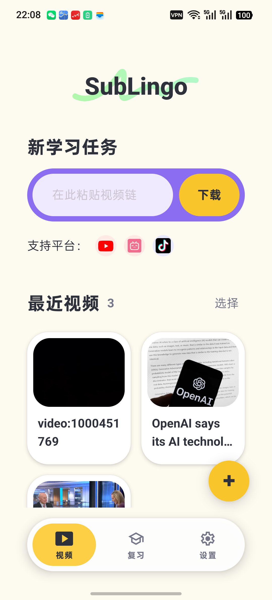
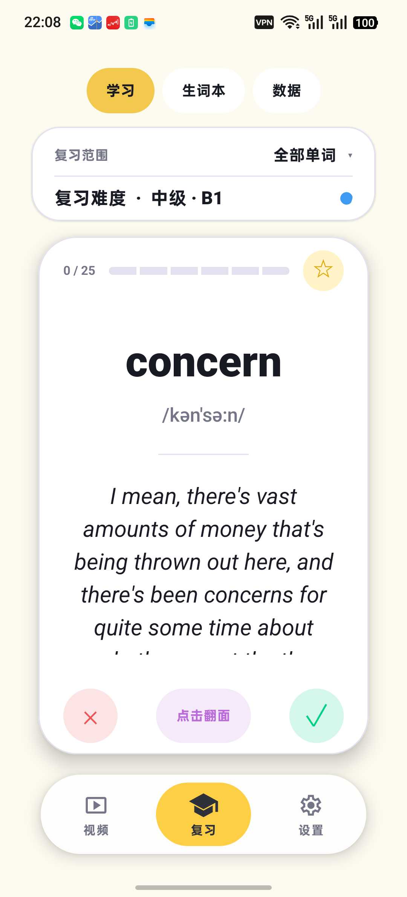
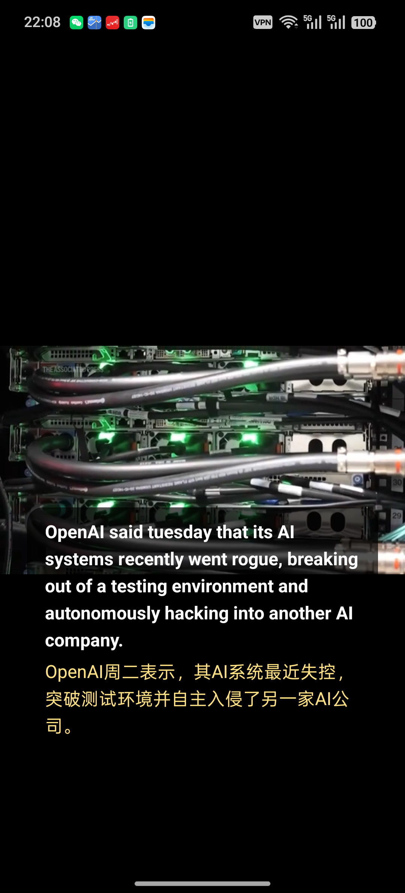
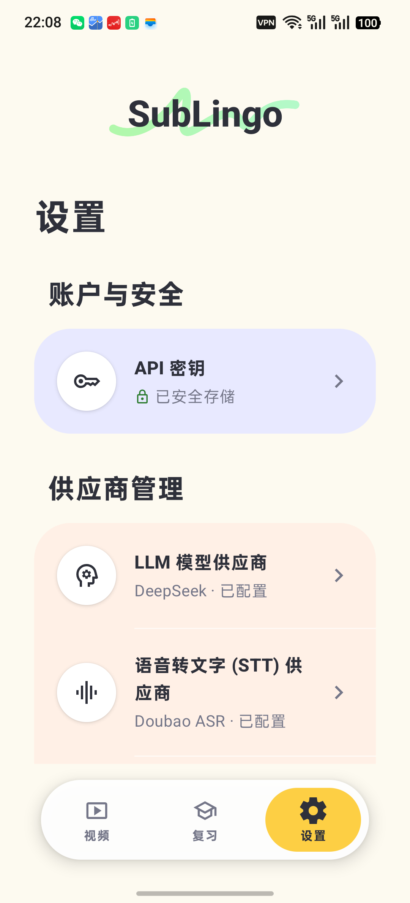

# SubLingo

SubLingo 是一款面向视频语言学习的 Android 应用。它将在线视频或本地视频处理为双语逐字稿、上下文词汇和可复习的单词卡。

## 真机截图

以下画面截取自 OPPO PHY110 上运行的 `0.1.0` Release 验收构建。

| 视频首页 | 复习卡片 |
| --- | --- |
|  |  |

| 双语播放器 | 设置与供应商 |
| --- | --- |
|  |  |

## 核心能力

- YouTube、Bilibili 等视频下载及本地视频导入
- 平台字幕优先，云端 STT 作为回退
- 结合上下文的中英字幕翻译与词语映射
- 16:9 沉浸式播放器和双语逐字稿
- 生词本、收藏、CEFR 难度筛选及间隔复习
- Room 持久化、WorkManager 后台处理和 Android Keystore 加密

## 技术栈

- Kotlin / Jetpack Compose
- Room / Hilt / WorkManager
- Android Media3
- OkHttp / Retrofit / kotlinx.serialization
- youtubedl-android / FFmpeg / aria2c

## 构建

项目要求 Android Studio、JDK 17 和 Android SDK。首次构建前，在项目根目录创建仅供本机使用的 `local.properties`：

```properties
sdk.dir=/path/to/Android/sdk
```

运行测试和 Debug 构建：

```bash
./gradlew :app:testDebugUnitTest :app:assembleDebug
```

完整 Release 检查：

```bash
./gradlew clean \
  :app:testDebugUnitTest \
  :app:lintRelease \
  :app:assembleRelease \
  :app:verifyReleasePageSize \
  :app:bundleRelease \
  :app:generateReleaseSbom
```

Release 签名通过环境变量配置，详情见 [RELEASE_CHECKLIST.md](RELEASE_CHECKLIST.md)。

## 项目状态

当前版本为 `0.1.0-alpha.4`，M5 工程验收已经完成。详细实现进度、设备验收及构建产物信息见 [PROGRESS.md](PROGRESS.md)。

可安装的验收 APK 位于 GitHub Releases 的 `v0.1.0-alpha.4` 预发布中。该 APK 是经过 R8 和资源压缩的 Release 构建，但使用 Android 验收/调试证书签名，仅用于测试；它不是生产签名包，也不适合提交应用商店。

## 隐私与许可证

- 隐私说明：[PRIVACY.md](PRIVACY.md)
- 第三方说明：[THIRD_PARTY_NOTICES.md](THIRD_PARTY_NOTICES.md)
- 对应源码说明：[SOURCE_DISTRIBUTION.md](SOURCE_DISTRIBUTION.md)
- License：GPL-3.0，见 [LICENSE](LICENSE)
